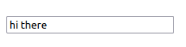
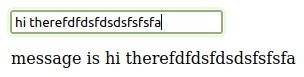

# AlpineJS notes

Notes on alpinejs (light weight, viewjs-like js library to add reactive and other functionality into existing pages that is not meant for full single page applications) from various sources:

https://www.youtube.com/watch?v=kJMT2WeNd2s

## Docs

https://alpinejs.dev/start-here

## Installation

Via cdn (8kb) or node import as usual, https://alpinejs.dev/essentials/installation
## Declaring a alpine component and event listeners

`x-data` as an attribute declares that a node is an alpine component.

It can be used directly and without a value in a tag to quickly add functionality e.g. to a button:

    <button x-data x-on:click="console.log('hello');">
    click
    </button> 

or in the parent with optional declaration of a data object (literal or referencing a js object defined in a separate script tag):

    

      <button x-on:click="open = !open">click</button>
      
hi there

    

The click handler `x-on:click` can also be abreviated with `@click`.

## Abreviations

To save time debugging misunderstood abreviations: The only abreviations available are `@` === `x-on` and `:` === `x-bind:`

## Binding forms to variables

We can bind forms to variables simply by referencing a variable declared in the object in the x-data attribute of the containing node (or the same node) with `x-model`:

    

      <input x-model="message" type="text">
    

Result:

This variable can be referenced (e.g. by `x-text` in other elements anywhere inside the containing x-data component and gets live updated on change (reactive 2-way data binding = state *yay*):

    

      <input x-model="message" type="text">
      
message is 

    

Modifiers can be added to the x-model object with a dot, e.g. `x-model.lazy=...`

- `.lazy`: update property only when focusing away from the element
- `.number`: force to store in number variable
- `.debounce`: wait for 250 miliseconds before updating the property. Useful for updating search fields only when the user stops typing. Custom timings can be defined like this: `x-model.debounce.500ms="search"`
- `.throttle`: like debounce but updates on specific intervals (default 250ms) instead of waiting the specified time after the last user input. Same syntax as debounce in regards to custom ms values.

## Adding functions to the x-data object

As the object referenced by the `x-data` attribute is just a normal js object (inline or external), we can also create and reference functions in it:

    

      <button @click="toggle">How hot is it in las vegas</button>
      
It is hot

    

This would be functionally equivalent to 

    

      <button @click="isShowing = !isShowing">How hot is it in las vegas</button>
      
It is hot

    

## Loops

We can loop over arrays / objects(?) from the x-data object in a foreach-like notation using `x-for`:

    

    <ul>
      <template x-for="person in people">
        <li x-text="person"></li>
      </template>
    </ul>
    

## Binding functions

Another example on binding functions. This adds the user input to the list on enter (note the `x-on:submit.prevent` (which could be abreviated to `@submit.prevent`)modifier to prevent an actual form submit):

    

      <!-- form to get user input to add to the list -->
      <form x-on:submit.prevent="addPerson">
        <input type="text" x-model="newText">
      </form>

      <!-- loop over users -->
      <ul>
        <template x-for="person in people">
          <li x-text="person"></li>
        </template>
      </ul>
    

## x-bind / disabling stuff

We can disable e.g. a submit button until a form is filled or during processing an ajax request:

    

      <!-- form to get user input to add to the list -->
      <form x-on:submit.prevent="addPerson">
        <input type="text" x-model="newText">
        <button type="submit" :disabled="isProcessing">Send</button>
      </form>

      <!-- loop over users -->
      <ul>
        <template x-for="person in people">
          <li x-text="person"></li>
        </template>
      </ul>
    

## Access variables from alpine in other javascript

